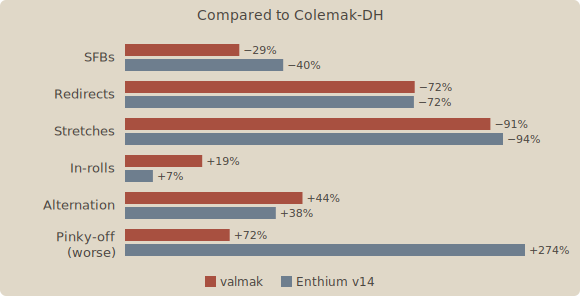

# valmak

A thumb-alpha evolution of Colemak-DH.

```
. q w f p b   = u o y j .
x n l s t g   - e a i h k
. z m c d v   / ; , . ' .
        r ↵   ⌫ ␣
```

**Interactive layout:** [valarauka-gh.github.io/valmak](https://valarauka-gh.github.io/valmak)

## Introduction

**valmak** is a keyboard layout that starts from the tried-and-true [Colemak-DH](https://colemakmods.github.io/mod-dh/) and evolves it to have fully modern stats by adopting a thumb-alpha and [Enthium](https://github.com/sunaku/enthium)'s vowel / punctuation block. I wanted to fix the major weaknesses (primarily redirects and stretches) and improve typing feel (in-rolls and alternation), while retaining as much muscle memory as possible and not sacrificing Colemak's minimal pinky movement as much as other modern approaches tend to.



Stats aren't everything, but do offer some evidence that the goals were met. Subjectively, valmak feels significantly more flowy than Colemak-DH while still being quite familiar. While primarily intended as an upgrade path, it ends up being a genuinely good option for anyone seeking a high-comfort thumb-alpha layout.

## Design

### Continuity with Colemak-DH

Sixteen keys don't move at all; the left hand stays almost entirely identical to Colemak-DH, preserving shortcut memory and significantly speeding up the learning curve. I cold-switched over the course of a single weekend and was typing at 35+ wpm with 95% accuracy by Monday; a few months in, I'm comfortable at 80+ wpm and bursting past 120 with 98% accuracy.

### The vowel hand

The right hand is essentially flipped-Enthium except for the pinky keys, with its programmer-optimized punctuation block. The vowel arrangement underwent the most experimentation; Hands Down usually uses `you/iea`, but this overloads the middle finger, and the `eo/au` pairing causes more frequent SFBs than the `eu/ao` choice made by most others. Enthium v10 instead went for `yuo/iea`, which fixes that but makes typing "you" and "io" more awkward. Putting `e` on the index for `you/iae` felt best to me; it reduces in-rolliness slightly but has the most balanced finger usage and lowest weak-redirects. This suggestion landed in Enthium v11 and has stuck since then, and I've kept the same setup for valmak.

### `r` on the left thumb

There are many candidates for which letter goes on the thumb, but modern consensus has largely settled on `r` for many good reasons that I won't rehash. Overall works really well.

### The `m` compromise

Finding the best spot for `m` on the consonant hand was the biggest challenge -- the chosen location has half-scissors with `n` and `s`, and needs a small stretch for `mp` and `mb`. I tried a bunch of alternatives and each made something else worse. I adapted to it quickly enough in practice.

## Layers and modifiers

Not strictly part of the alpha layout, but my modifier setup seems uncommon so I figured I'd showcase it. It's a modified [Miryoku](https://github.com/manna-harbour/miryoku/tree/master/docs/reference) scheme where Shift is moved onto the thumbs instead, allowing it to be comboed with the adjacent layer keys. This lets the numpad double as a symbol layer using the standard top-row symbols, removing the mental load of a custom symbol layout.

The other major difference is Miryoku puts layer activation on the opposite side, but I prefer same-side: that way I can one-hand numbers, symbols, or navigation (including e.g. shift-arrow-keys), only needing to involve the other hand if Ctrl/Alt/Win modifiers are needed as well.

## Other layouts to try

### Standard

[Gallium](https://github.com/GalileoBlues/Gallium) and [Graphite](https://github.com/rdavison/graphite-layout) are the current gold standard among finger-only layouts and easy to recommend. If you want a more Colemak-flavored take on those, [Gralmak](https://github.com/DreymaR/Gralmak) is highly recommended. [Sturdy](https://oxey.dev/sturdy/) is another great choice, with a stronger in-roll and pinky-comfort focus.

### Thumb-alpha

[Enthium](https://github.com/sunaku/enthium) is fantastic -- I started learning it as my move-up path from Colemak-DH before realizing I could merge the best ideas of both into valmak. [Night](https://valorance.net/night/) is highly recommended by the AKL community. [Afterburner](https://blog.simn.me/posts/2025/afterburner/) and [D5](https://www.reddit.com/r/KeyboardLayouts/comments/1roiizb/d5_a_keyboard_layout_that_minimizes_redirects_and/) have some incredibly creative ideas that are probably the future, but need more brain-rewiring than I wanted to deal with.

## License

The valmak layout and this site are released under the [MIT License](./LICENSE). Fonts are redistributed under the SIL Open Font License 1.1.
